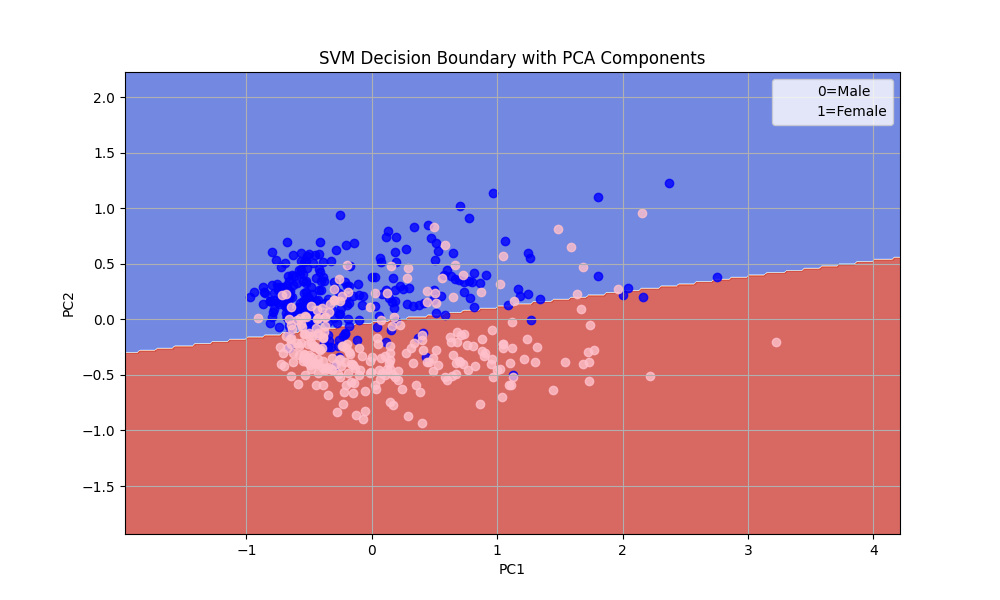

## How to quantify gender bias in word embeddings?

This Machine Learning tool helps measure and visualize gender bias in word embeddings. 

The tool is based on a pipeline that uses BERT embeddings as a starting point. The pipeline is composed by the following modules:

1. Logistic Regression - l1 regularization
2. PCA
3. Support Vector Classifier

The tool is able provide a visualization instrument to analyze how much word is biased towards male or female gender, here is an example of the visualization:

Performance Metrics:
| **Metric**                               |  **Value** |
|------------------------------------------|------------|
| C (Logistic Regression)                  | 0.175      |
| C (SVM)                                  | 0.375      |
| Accuracy                                 | 0.7786     |
| Number of Selected Features (pre-PCA)    | 38         |
